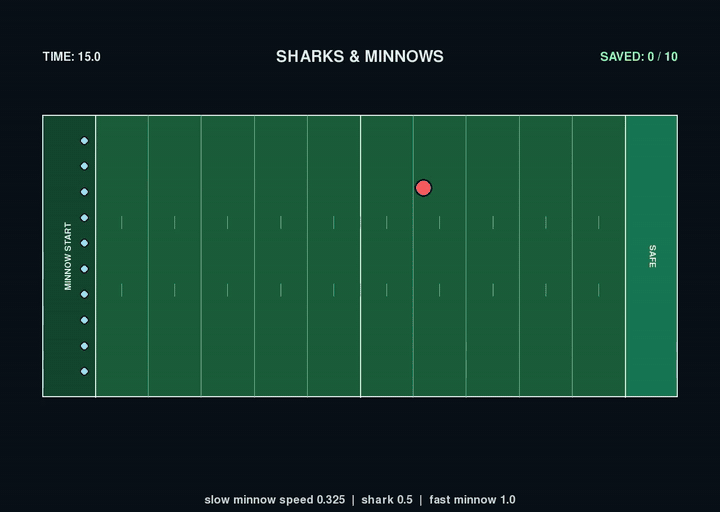
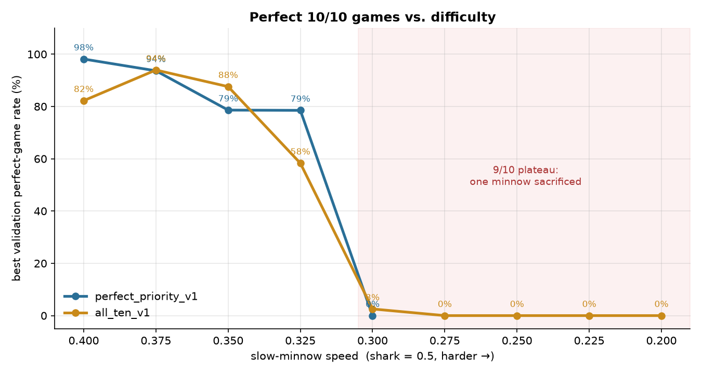
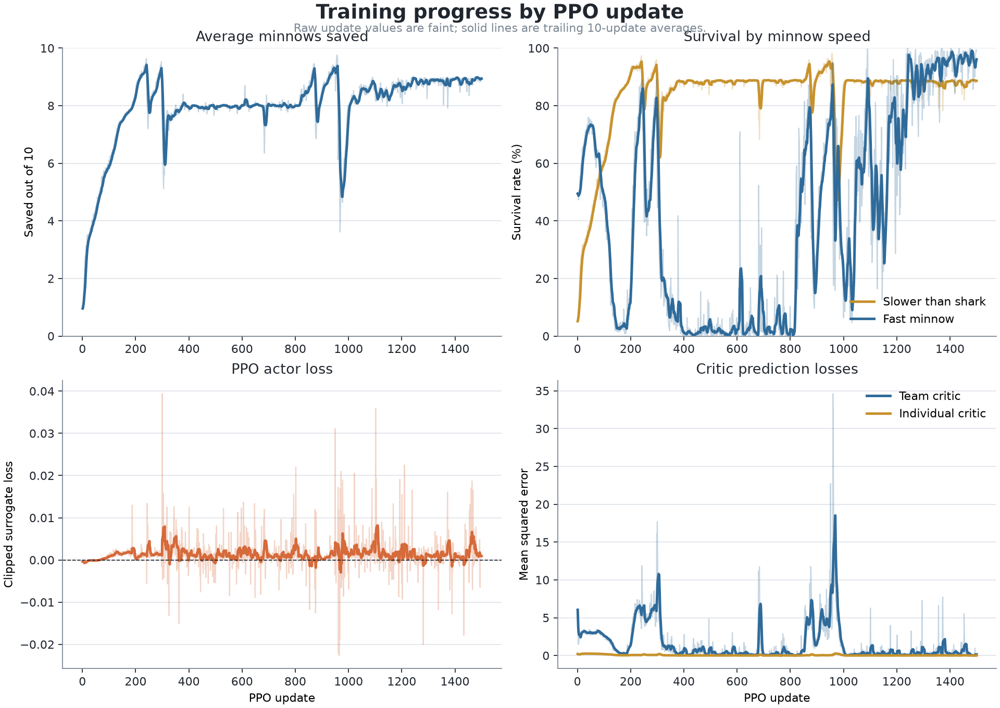
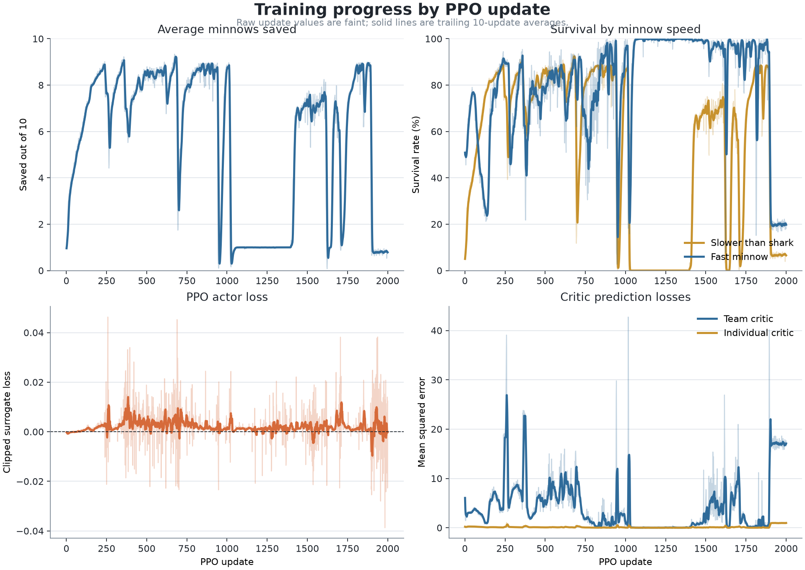
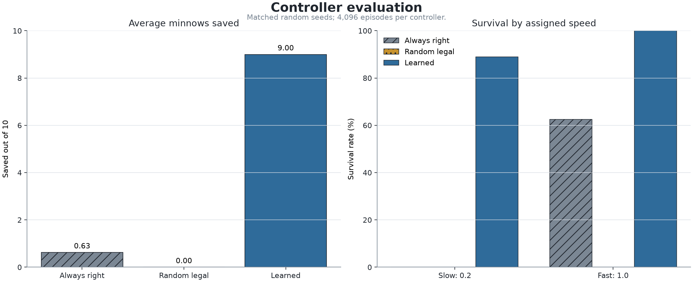

# Sharks & Minnows: Multi-Agent PPO

A GPU-vectorized reinforcement learning project. One attention-based policy controls a team of ten minnows that must cross a football field past a shark that is faster than nine of them.

<p align="center">
  
  <br><em>Learned policy, slow-minnow speed 0.325: the fast minnow draws the shark to one sideline while the slow minnows cross the other way. All 10 reach safety.</em>
</p>

## Watch the runs

Every video below is a real, deterministic rollout of a checkpoint that ships in [`models/`](models). You can regenerate any of them with [`record.py`](record.py) (see [Reproduce the videos](#reproduce-the-videos)).

| Run | Slow-minnow speed | Result | Video |
| --- | :---: | :---: | --- |
| Perfect game | 0.400 | **10 / 10** | [▶ perfect_speed_0.400.mp4](media/perfect_speed_0.400.mp4) |
| Perfect game | 0.375 | **10 / 10** | [▶ perfect_speed_0.375.mp4](media/perfect_speed_0.375.mp4) |
| Perfect game (hardest solved) | 0.325 | **10 / 10** | [▶ perfect_speed_0.325.mp4](media/perfect_speed_0.325.mp4) |
| Plateau behaviour | 0.200 | 9 / 10 | [▶ nine_of_ten_speed_0.200.mp4](media/nine_of_ten_speed_0.200.mp4) |

The videos play at 0.6× real time. GitHub opens each `.mp4` in an in-browser player.

## The game

| | |
| --- | --- |
| Field | Football-field proportions (120 × 53.3), with a start end-zone on the left and a safe end-zone on the right |
| Minnows | 10 per team. **1 fast** minnow (speed 1.0) and **9 slow** minnows (speed 0.2 to 0.4, set by the curriculum) |
| Shark | Speed 0.5, so it is faster than every slow minnow. It deterministically chases the nearest active minnow and starts at a random height |
| Episode | 15 s of game time, with a policy decision every 0.1 s and 4 physics sub-steps per decision |
| Win condition | A minnow is saved when it reaches the right end-zone. A **perfect game** saves all 10 |

The slow minnows cannot outrun the shark. To save all of them, the team has to coordinate: the fast minnow must pull the shark away while the slow minnows cross, and then it must escape without being caught.

## Approach

- **Environment:** [`environment.py`](environment.py) is a fully vectorized PyTorch simulator that steps thousands of games at once on the GPU. Training used 512 parallel environments on an RTX 5070 Laptop GPU, at roughly 1 to 2 s per PPO update.
- **Policy:** [`policy.py`](policy.py) is a centralized, permutation-equivariant transformer. Each minnow is encoded as a token, and a global token carries the shark position, the time left and the fraction of slow minnows still unresolved. The model has 2 self-attention layers, 4 heads and 64-d embeddings, and outputs one 2-D velocity per minnow. It has two critics, one for the team value and one for per-minnow values.
- **Training:** [`ppo.py`](ppo.py) and [`train.py`](train.py) implement PPO with GAE, KL early stopping, and KL rollback with automatic learning-rate decay. Validation-based rollback restores a checkpoint when validation performance collapses.
- **Curriculum:** Training starts with slow minnows at 0.4 and makes them 0.025 slower only after the policy passes a performance gate (average saved, fast-minnow survival and perfect-game rate over a rolling window).
- **Reward:** Minnows are rewarded for crossing and for surviving to the end, with a +10 team bonus for a perfect game. Progress shaping on the trailing slow minnow is potential-based and discount-correct. Small penalties discourage wall-hugging and losing the fast rescuer. The full reward accounting is in [`RL_NOTES.md`](RL_NOTES.md).

## Findings

<p align="center"></p>

### 1. Decoy coordination emerged without being scripted

No reward term tells the fast minnow to act as a decoy. The policy learned the strategy on its own: the fast minnow runs to one sideline, the nearest-target shark follows it, and the nine slow minnows cross on the far side. The fast minnow then outruns the shark into the end-zone. This emergent behaviour produces every perfect game in the videos.

### 2. Near-perfect play down to slow-minnow speed 0.325

Best deterministic **validation** perfect-game rates (1,024 fixed-seed games) during the curriculum:

| Slow speed | `perfect_priority_v1` | `all_ten_v1` |
| :---: | :---: | :---: |
| 0.400 | **98.1 %** | 82.2 % |
| 0.375 | 93.7 % | **93.9 %** |
| 0.350 | 78.6 % | **87.6 %** |
| 0.325 | **78.5 %** | 58.3 % |
| 0.300 | 0 % | 2.5 % |
| 0.275 to 0.200 | n/a | 0 % |

For comparison, the fixed baselines at slow speed 0.2 score 0 % perfect games: *always-right* saves 0.63 / 10 and *random* saves 0.0002 / 10.

### 3. Below speed 0.3, training settles on a "sacrifice one" local optimum

At slow speed 0.3 and below, both runs converge to a stable strategy that saves exactly nine: 8.99 / 10 on average with 0 % perfect games. The held-out evaluation of `all_ten_v1` at the target speed 0.2 (4,096 fresh games) scored:

| Metric | Learned | Always-right | Random |
| --- | :---: | :---: | :---: |
| Mean saved | **9.00 / 10** | 0.63 | 0.00 |
| Slow-minnow survival | **88.9 %** | 0 % | 0 % |
| Fast-minnow survival | **100 %** | 63 % | 0 % |
| Perfect games | 0 % | 0 % | 0 % |

The team gives up one slow minnow so the other eight can escape while the shark is busy. That trade is worth a lot of return, and the jump from nine saved to ten requires a very different joint behaviour that exploration never discovers. The [`nine_of_ten_speed_0.200.mp4`](media/nine_of_ten_speed_0.200.mp4) video shows this plateau policy.

### 4. What was tried to break the plateau

The table below summarizes the runs, all kept in the local `checkpoints/` directory (not committed because of size):

| Run | Change | Outcome |
| --- | --- | --- |
| `adaptive_team_v1`, `adaptive_team_freeze` | First fixed-speed-0.2 attempts | 5.5 to 7.2 / 10 saved, 0 % perfect |
| `boundary_finish_v1` | Wall-pressure and early-finish shaping | 6.7 / 10, fast survival 99.5 % |
| `stable_balanced_v1` | Balanced team/individual advantages and a curriculum | 9.2 / 10 at 0.4 but 0 % perfect: the plateau appears even at easy speeds |
| `perfect_priority_v1` | +10 perfect-team bonus and perfect-first checkpointing | **98 % perfect at 0.4**, 79 % at 0.325, then collapses to 9 / 10 at 0.3 |
| `all_ten_v1` | Start-position jitter to break the fixed "sacrifice the lowest row" shortcut | Reached the 0.2 target speed, but held at 9 / 10 |
| `all_ten_v2` | Longer rollouts and a stricter gate | Stuck at 0.375 (19 % perfect) after 2,640 updates |

The most recent revision, described in [`RL_NOTES.md`](RL_NOTES.md), adds a one-time −10 first-failure penalty. It also makes actor advantages 100 % team-based, sets GAE λ = 0.99, uses 256-step rollouts, and adds a 90 %-perfect curriculum gate. With these changes a 10 / 10 game is worth 30 undiscounted reward and a 9 / 10 game is worth 7. This revision is covered by unit tests but **has not been trained yet**.

<details>
<summary><b>Training curves and evaluation plots</b></summary>

`perfect_priority_v1` training:


`all_ten_v1` training:


`all_ten_v1` held-out evaluation at slow speed 0.2 compared with the baselines:

</details>

### Earlier task variant

An earlier version of the environment gave slow minnows randomized speeds between 0.4 and 0.6. On a 10,000-game held-out test in that setting, the policy saved **9.73 / 10 on average with 84.1 % perfect games**, against 6.41 / 10 and 0 % perfect for the always-right baseline.

## Quick start

```sh
# Requires Python ≥ 3.11 and uv. The CUDA 13 PyTorch wheel is pinned in pyproject.toml.
make setup

# Watch a shipped model play in a live pygame window (SPACE pause, R restart, ESC quit)
make replay CHECKPOINT=models/perfect_priority_speed_0.400.pt

# Train
make smoke                                   # 50-update sanity run
make train-curriculum RUN=my_run UPDATES=2000
make holdout RUN=my_run                      # 10,000-game held-out evaluation
make help                                    # all targets and knobs

# Unit tests (CPU only)
CUDA_VISIBLE_DEVICES='' .venv/bin/python -m unittest -v test_all_ten
```

> `replay.py` runs the environment at its default slow speed of 0.2. To watch a model at the speed it was trained on, use `record.py --slow-speed`.

### Reproduce the videos

`record.py` renders headlessly with pygame and pipes the frames to `ffmpeg`. When no seed is given, it searches for the first seed that produces the requested outcome.

```sh
.venv/bin/python record.py --checkpoint models/perfect_priority_speed_0.325.pt \
    --slow-speed 0.325 --want perfect --playback-rate 0.6 --output media/perfect_speed_0.325.mp4

.venv/bin/python record.py --checkpoint models/all_ten_speed_0.200.pt \
    --slow-speed 0.2 --want nine --playback-rate 0.6 --output media/nine_of_ten_speed_0.200.mp4
```

## Repository layout

```
environment.py     Vectorized GPU simulator, rewards, curriculum speed control
policy.py          Centralized attention actor with team and individual critics
ppo.py             PPO update, GAE, KL early stop and rollback
train.py           Training loop, curriculum gate, validation, checkpointing
evaluate.py        Learned policy vs. always-right and random baselines
replay.py          Interactive pygame viewer
record.py          Headless MP4 recorder used for the videos above
game_board.py      Field rendering
visualization.py   Training and evaluation plots
test_all_ten.py    Reward-accounting and PPO-target unit tests
models/            Checkpoints used in the videos
media/             Videos, GIF and plots
RL_NOTES.md        Design notes on the latest reward and PPO revision
```
